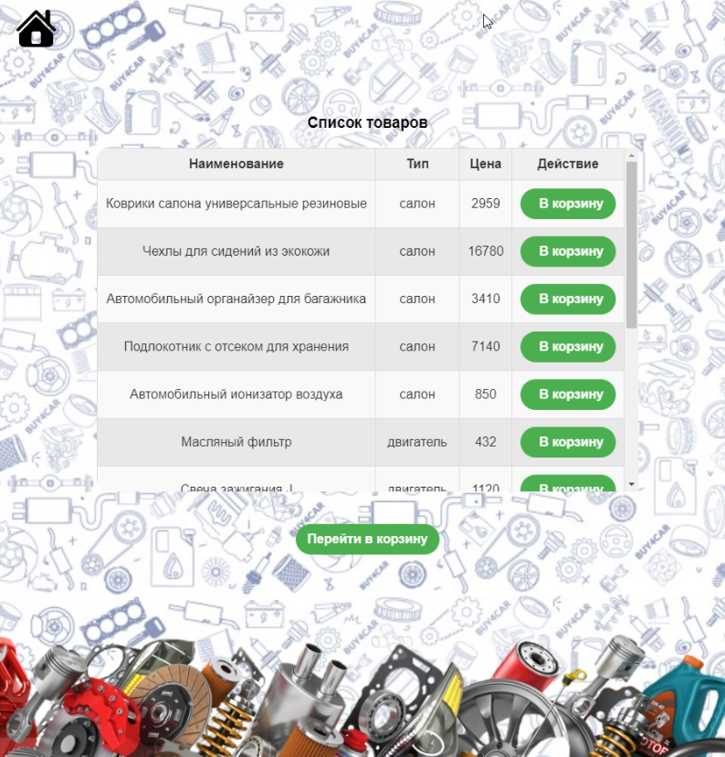
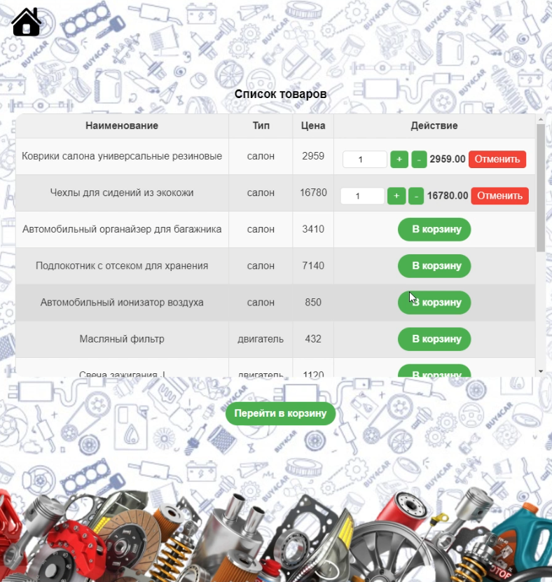
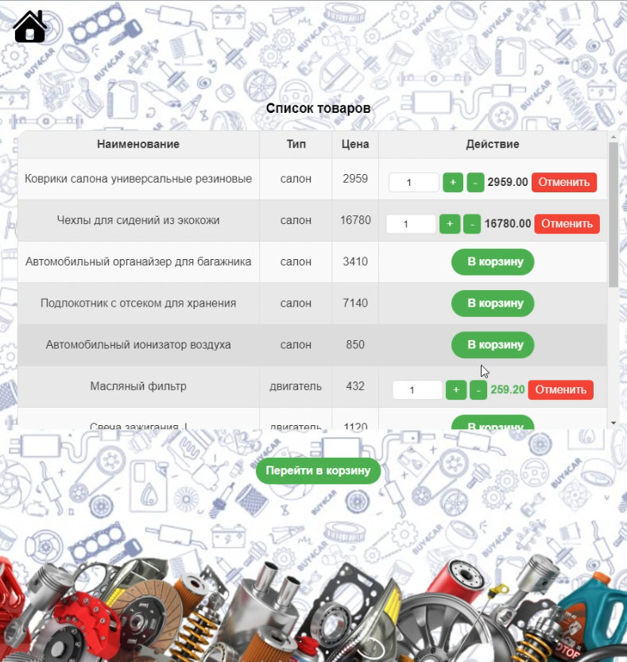
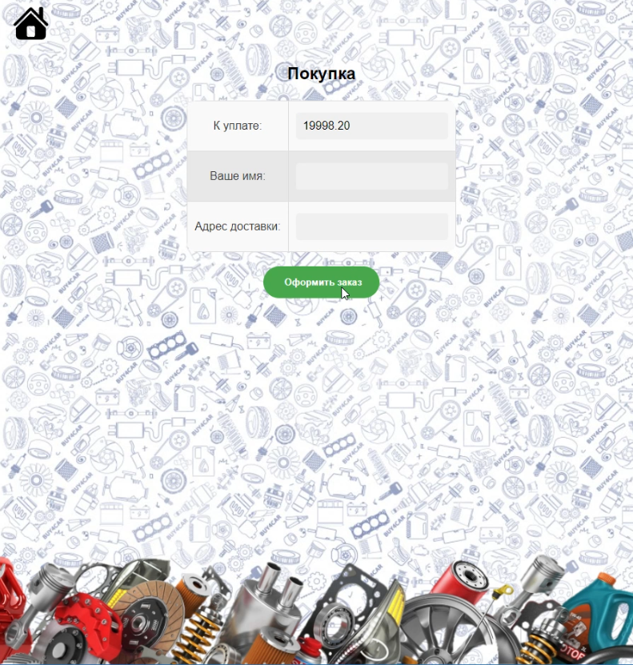
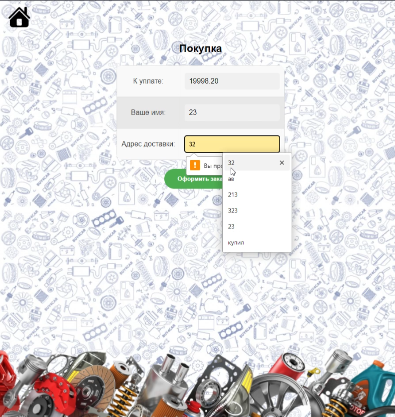
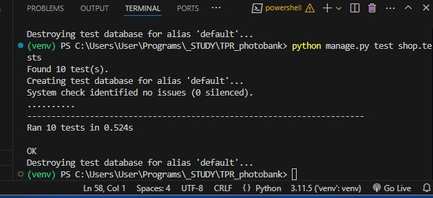

# Лабораторная 2 по дисциплине "Технологии программирования"

Цели работы:

1. Познакомиться c моделью MVC, ее сущностью и основными фреймворками на ее основе.
2. Разобраться с сущностями «модель», «контроллер», «представление», их функциональным
   назначением.
3. Получить навыки разработки веб-приложений с использованием MVC-фреймворков, написания
   модульных тестов к ним и интеграции приложений в конвейер CI / CD.
4. Получить навыки управления автоматизированным тестированием и разворачиванием
   программного обеспечения, расположенного в системе Git, с помощью инструмента Travis CI.

---

Постановка общей задачи:

1. Сделать форк (копию) репозитория по адресу https://github.com/kpdvstu/PTLab2.
2. Создать базу данных PostgreSQL.
3. Создать виртуальное окружение и установить в него необходимые пакеты.
4. Протестировать проект.
5. Запустить проект.

---

Постановка индивидуальной задачи:

1. Добавить лицензию в проект.
2. Доработать проект, согласно **Варианту 12**.
3. Созадать модульные тесты к проекту и загружать их в отдельную ветку. Когда все тесты пройдут, ветку слить с главной.

---

### О разработке 
Вариант 12
| Тип магазина | Функциональность приложения |
|:--------------:|:------------------------------------------------------------------------------------------------------------:|
| Магазин товаров для автомобиля | При одновременной покупке двух экземпляров товаров разного вида покупателю должна предоставляться скидка 40% на любой третий товар. |

---

### Описание веб-приложения:

На главной странице сайта расположен список из товаров для автомобиля в виде таблицы, с полями: наименование, тип, цена и действие. (действие - активная кнопка,которую пользователь может нажать и добавить в корзину товар, результат подобного действия, когда пользователь нажал на кнопку "Добавить" у двух товаров вы можете просмотреть на рисунке 2).

  
  
 Рисунок 1 – Главная страница сайта 
 

  
  
 Рисунок 2 – Главная страница сайта (выбрано 2 элемента) 
 

Когда же пользователь выберет 3 товара, РАЗНОЙ категории (т.е. например "салон" и "двигатель"), то скидка в размере 40% должна применяться на ЛЮБОЙ третий товар. (цена окрашивается в зеленый цвет и скидка сразу же применяется автоматически к стоимости товара).

  
  
 Рисунок 3 – Главная страница сайта (применена скидка) 
 

Далее пользвоатель после выбора нужных ему товаров для автомобиля может нажать на кнопку "Перейти в корзину", что перенаправит его на страницу из рисунка 4. (Итоговая стоимость считается автоматически исходя из кол-ва и стоимости выбранных товаров, а также с учетом примененной скидки). 

  
  
 Рисунок 4 – Страница корзины 
 

На данной странице корзины пользователю необходимо нажать на кнопку "Оформить заказ", чтобы заказ подтвердился, однако все поля должнгы быть заполнены, иначе же выскакивают предупреждения.

  
  
 Рисунок 5 – Страница корзины (пустые поля) 
 

---
В процессе разработки веб-приложения на Django важно обеспечивать стабильность и корректную работу всех его компонентов, особенно при внесении изменений в код. Для этого был разработан набор автотестов, который позволяет автоматизировать проверку функциональности и убедиться, что изменения не влияют на ключевую логику работы сайта.

В результате была написана серия из 10 автотестов, которые успешно прошли все этапы выполнения и подтвердили, что внесенные изменения не повлияли на функциональность приложения. Результаты выполнения тестов представлены на рисунке 6.

  
  
 Рисунок 6 – Результаты автотестирвоания 
 

---

### Выводы:  
В данной лабораторной работе была изучена работа с фреймворком Django на основе создания своего собственного приложения - магазина товаров для автомобиля.
